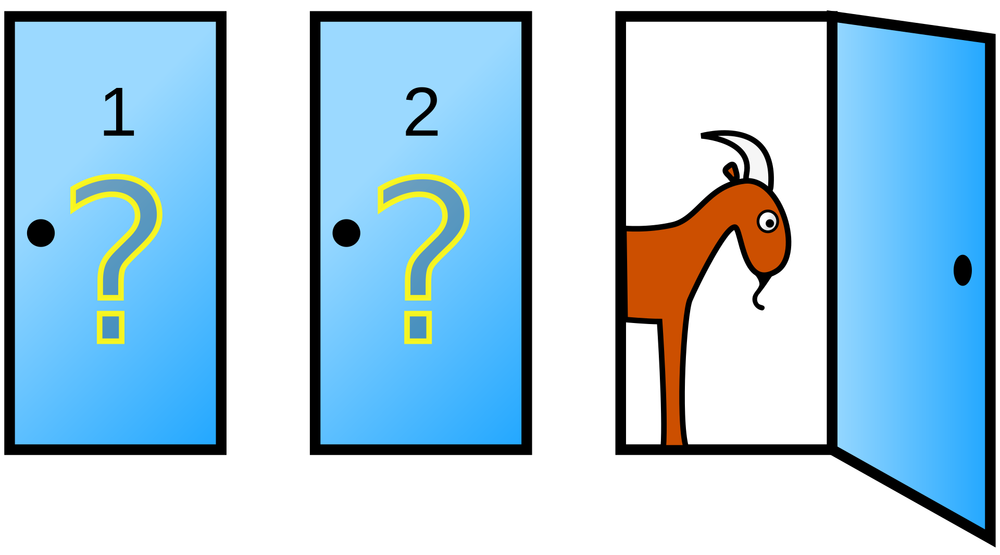

# Probabilistic Programming: The Monty Hall Problem

## Overview

This repository explores the famous Monty Hall Problem through both traditional programming and probabilistic programming approaches. The project demonstrates how probabilistic programming languages (PPLs) can help bridge the gap between our intuitive reasoning and formal probability theory, making counter-intuitive solutions more transparent and understandable.

## The Monty Hall Problem

The Monty Hall problem is a probability puzzle named after the host of the television game show "Let's Make a Deal":

1. There are three doors, behind one is a car (prize) and behind the other two are goats (non-prize).
2. You select one door.
3. The host, who knows what's behind each door, opens one of the remaining doors to reveal a goat.
4. The host then offers you the option to stick with your original choice or switch to the other unopened door.

**The counter-intuitive solution**: You should always switch doors, as it doubles your chances of winning from 1/3 to 2/3.

This problem is fascinating not just for its counter-intuitive solution, but for what it reveals about human reasoning. Even brilliant mathematicians like Paul Erdős initially rejected the correct solution, and many people persist in their incorrect intuitions even after seeing simulations or playing for money.

## Implementations

### Traditional Simulation

The repository includes a classic simulation that empirically proves the 2/3 probability by running thousands of trials. This approach is intuitive but doesn't help us understand why switching is better.

### Probabilistic Programming

Our PPL implementation using Pyro explicitly models:

1. The causal structure of the problem
2. The host's constrained decision-making process
3. The relationships between variables

This approach makes the solution more transparent by highlighting the critical insight: the host's choice provides information that makes switching advantageous.

### Learning Models

We implement two types of learning agents:

1. **Simple Reinforcement Learner**: Updates a value estimate for switching based on outcomes
2. **Bayesian Learner**: Maintains explicit probability distributions over outcomes

These models demonstrate how an agent might learn the optimal strategy through experience, even without understanding the underlying math.

### Cognitive Modeling

The most sophisticated implementation uses probabilistic programming to model how different types of people reason about the problem. We model three cognitive parameters:

1. **Host Awareness**: How much the player considers the host's knowledge
2. **Switch Bias**: The player's baseline tendency to switch doors
3. **Rationality**: How consistently the player follows their strategy

## Find it on our blog
Read more [on our blog](https://crowintelligence.org/2025/03/06/why-probabilistic-programming-a-journey-through-the-monty-hall-problem/)